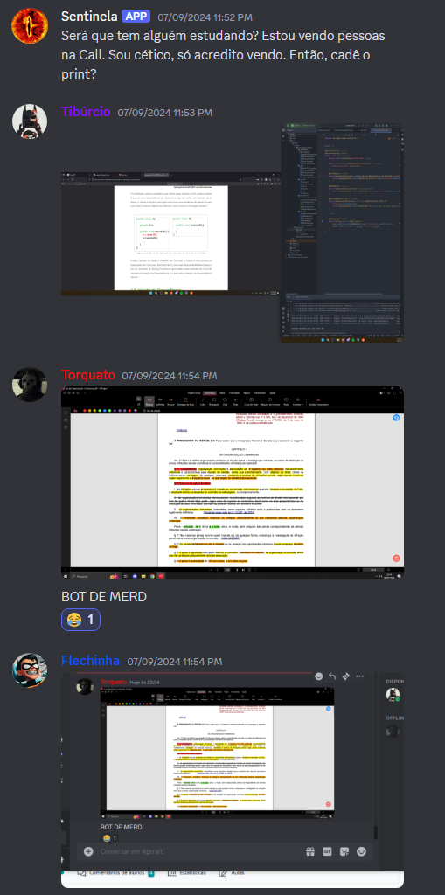

# Sentila - Discord BOT


> Este bot para Discord foi criado com um propósito simples, porém eficaz: garantir que todos os membros do canal de estudos estejam realmente focados em suas atividades. Em intervalos aleatórios, o bot enviará uma mensagem solicitando uma captura de tela dos participantes na chamada de voz. Essa medida ajuda a manter a disciplina e evitar a procrastinação, promovendo um ambiente de estudo mais produtivo entre amigos.

> A qualquer momento, você pode ser solicitado a provar que está no caminho certo. Portanto, esteja sempre preparado para não ser pego desprevenido! 

<div align="center">
  
</div>

### Ajustes e melhorias

O projeto ainda está em desenvolvimento e as próximas atualizações serão voltadas para as seguintes tarefas:

- [x] Enviar a mensagem
- [x] Verificar se há pessoas no canal de voz
- [ ] Identificar quem está no canal e marca-los na mensagem


## 💻 Pré-requisitos

Antes de começar, verifique se você atendeu aos seguintes requisitos:

- Você instalou a versão mais recente de `<Java / dependência>`
- Você tem uma máquina `<Windows>`
- Você leu `<documentação_relacionada_ao_projeto>`

## 🚀 Instalando <Sentinela_Discord_Bot>

Para instalar o <Sentinela_Discord_Bot>, siga estas etapas:

Clone o repositório 
```
git https://github.com/natanPrs/fileReader.git
```

## 🤝 Colaboradores

Agradecemos às seguintes pessoas que contribuíram para este projeto:

<table>
  <tr>
    <td align="center">
      <a href="https://github.com/natanPrs" title="natanPrs">
        <br>
        <sub>
          <b>Natan Pires</b>
        </sub>
      </a>
    </td>

</table>

## 😄 Isso é tudo

Este é um projeto com fins acadêmicos, mas, caso queira utilizá-lo de alguma maneira, sinta-se à vontade.